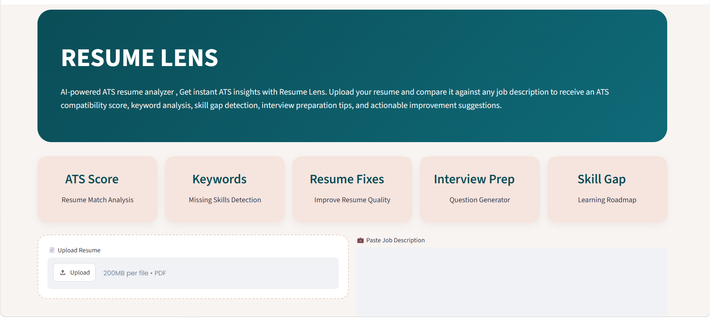
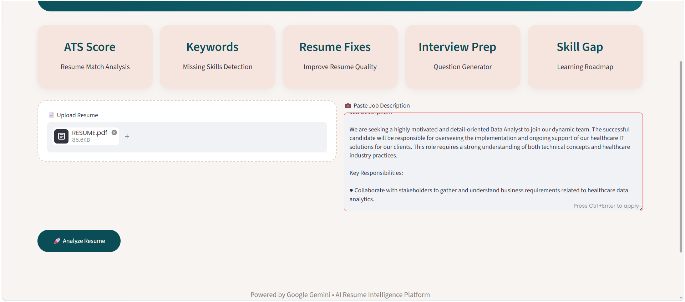
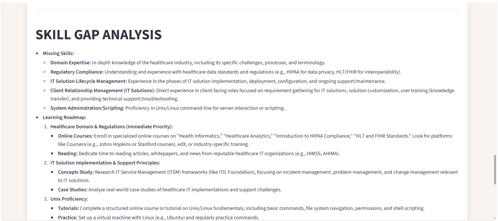
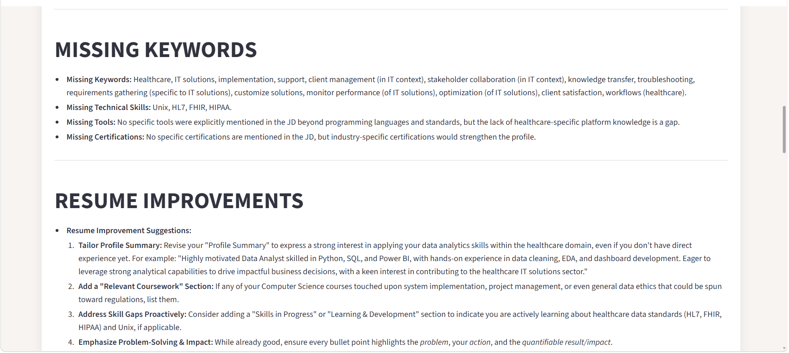
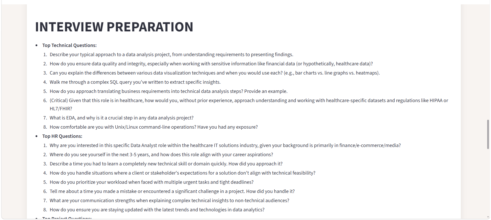

# Resume Lens – Intelligent ATS Resume Analyzer

Resume Lens is an AI-powered Applicant Tracking System (ATS) analyzer that helps job seekers evaluate and optimize their resumes against specific job descriptions.

Built using Google Gemini and Streamlit, the platform provides detailed ATS insights, keyword gap analysis, interview preparation assistance, skill gap detection, and personalized resume improvement recommendations.

---

## Features

### ATS Match Analysis

* Calculates resume compatibility with a target job description
* Generates an ATS Match Score
* Highlights candidate strengths and weaknesses
* Provides hiring recommendations

### Missing Keywords Detection

* Identifies missing technical keywords
* Detects absent tools, technologies, and certifications
* Highlights important skills required by recruiters

### Resume Improvement Engine

* Suggests stronger resume wording
* Improves project descriptions
* Enhances achievement statements
* Provides formatting recommendations

### Interview Preparation

* Generates technical interview questions
* Generates HR interview questions
* Creates project-based discussion questions
* Helps candidates prepare for real interviews

### Skill Gap Analysis

* Identifies missing skills
* Recommends learning paths
* Suggests certifications
* Calculates job readiness percentage

---

## Demo Workflow

1. Upload Resume (PDF)
2. Paste Target Job Description
3. Click Analyze Resume
4. AI evaluates the resume against job requirements
5. Receive detailed ATS insights and recommendations

---

## Technology Stack

### Frontend

* Streamlit

### AI & NLP

* Google Gemini API

### Backend

* Python

### PDF Processing

* PDF2Image
* Pillow

### Environment Management

* Python Virtual Environment
* dotenv

---

## Project Architecture

```text
Resume PDF
      │
      ▼
PDF Processing
      │
      ▼
Google Gemini AI
      │
      ▼
ATS Analysis Engine
      │
      ├── ATS Score
      ├── Keyword Analysis
      ├── Resume Suggestions
      ├── Interview Questions
      └── Skill Gap Report
```

---


## Application Preview

### Home Page






### Analysis dashboard


### SkillGap Analysis



### missing words



### Interview prep




---


## Skills Demonstrated

* Python Development
* Prompt Engineering
* Generative AI Integration
* Streamlit Application Development
* API Integration
* PDF Processing
* UI/UX Design
* Software Deployment
* Git & GitHub

---

## Author

Ayushi

 Data Science Enthusiast | AI & Machine Learning Learner |
